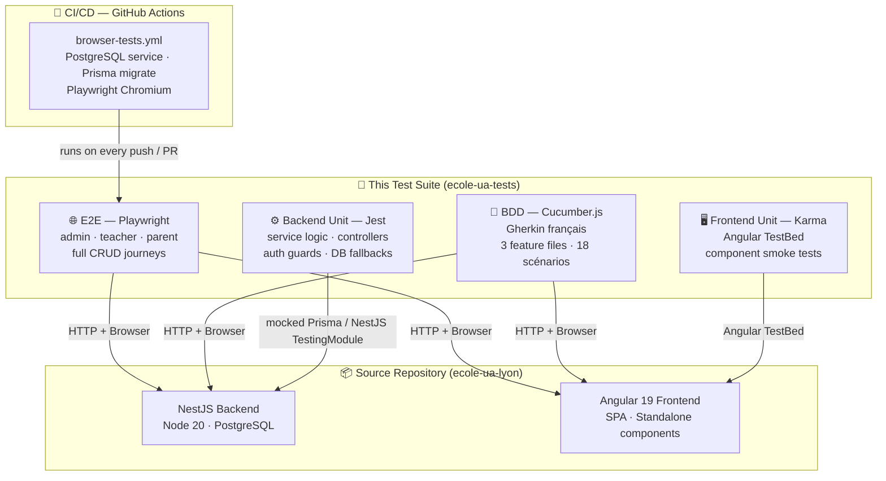

# 🎓 École Ukrainienne de Lyon — Test Suite

<div align="center">

[](https://github.com/Irrryna/ecole-ua-lyon/actions/workflows/browser-tests.yml)
[](https://playwright.dev)
[](https://cucumber.io)
[](https://jestjs.io)
[](https://nestjs.com)
[](https://angular.dev)
[](https://www.typescriptlang.org)

**Automated quality assurance for a bilingual (FR/UA) school management platform.**  
Full-stack testing: backend services · REST controllers · Angular components · end-to-end user journeys · BDD scenarios in French Gherkin.

[View the live app](https://www.ecole-ua-lyon.fr) · [Main repository](https://github.com/Irrryna/ecole-ua-lyon) · [CI pipeline](#️-cicd-pipeline)

</div>

---

## 📊 Coverage at a Glance

| Layer | Framework | Suites | Scenarios |
|---|---|---|---|
| **Backend — service logic** | Jest + NestJS Testing | 2 | 14 test cases |
| **Backend — REST controllers** | Jest + NestJS Testing | 2 | 7 test cases |
| **Frontend — Angular components** | Karma + Jasmine | 26 | 26 smoke specs |
| **End-to-end — full user journeys** | Playwright (Chromium) | 3 | ~60 UI assertions |
| **BDD — user journeys in French Gherkin** | Cucumber.js (Chromium) | 3 | 18 scenarios |
| **Total** | | **36** | **~125** |

---

## 🗺️ Architecture Overview



---

## 🧪 Test Suites in Detail

### 🥒 BDD Tests (Cucumber.js + French Gherkin)

Three feature files express user journeys in French Gherkin (`# language: fr`),
following enterprise BDD conventions used in French-speaking development teams.
Each scenario is backed by typed step definitions that interact with the real browser via Playwright.

| Feature file | Role | Scenarios |
|---|---|---|
| `features/admin-dashboard.feature` | Admin | 6 |
| `features/teacher-dashboard.feature` | Teacher | 8 |
| `features/parent-dashboard.feature` | Parent | 4 |

#### Example — Teacher homework lifecycle

```gherkin
# language: fr
Fonctionnalité: Tableau de bord enseignant

  Contexte:
    Étant donné les données de test sont prêtes
    Et je suis connecté en tant qu'enseignant

  Scénario: Cycle de vie complet d'un devoir — créer, modifier, supprimer
    Quand je clique sur la ligne de ma classe
    Et je crée un nouveau devoir
    Alors le devoir créé apparaît dans la liste
    Quand je modifie la description du devoir créé
    Alors la description modifiée apparaît dans la liste
    Quand je supprime le devoir modifié
    Alors le devoir ne figure plus dans la liste
```

#### Step definition architecture

Steps are split by responsibility and reuse a shared `CustomWorld` state object:

```
step-definitions/
├── common.steps.ts    # authentication, sidebar navigation, generic text/URL assertions
├── admin.steps.ts     # classes CRUD, subjects, user validation, content management
├── teacher.steps.ts   # homework, announcements, resources, content lifecycle
└── parent.steps.ts    # child registration, class navigation, address update
```

```typescript
// support/world.ts — shared state across steps within a scenario
export class CustomWorld extends World {
  page!: Page;
  context!: BrowserContext;
  seedData!: DashboardSeed;

  // ephemeral values produced by "When" steps and consumed by "Then" steps
  newHomeworkDescription?: string;
  updatedHomeworkDescription?: string;
  newResourceTitle?: string;
  // …
}
```

#### Credential management

Runtime credentials are loaded from `.env.bdd` (gitignored).
A template is provided:

```bash
cp .env.bdd.example .env.bdd
# then fill in the real values
```

```ini
# .env.bdd.example
ADMIN_LOCAL_EMAIL=admin@ecole.com
ADMIN_LOCAL_PASSWORD=MonSuperMotDePasse123!
# BASE_URL=https://www.ecole-ua-lyon.fr   # defaults to http://127.0.0.1:4200
# API_BASE_URL=https://api.ecole-ua-lyon.fr
```

`support/env-defaults.ts` — the first file loaded by Cucumber — parses `.env.bdd`
and sets safe fallback values (`SKIP_ADMIN_LOCAL`, `BASE_URL`, `API_BASE_URL`)
before any other module is initialised.

---

### 🌐 End-to-End Tests (Playwright)

Three spec files cover the three user roles of the platform.  
Each test seeds fresh data via the REST API before interacting with the real browser.

| File | Role | What is tested |
|---|---|---|
| `admin-dashboard.spec.ts` | Admin | Classes CRUD, subjects CRUD, user validation, quick notes, content management |
| `teacher-dashboard.spec.ts` | Teacher | Homework CRUD, announcements, educational resources, content, route params |
| `parent-dashboard.spec.ts` | Parent | Dashboard visibility, class navigation, child registration & update |

#### Data Seeding Strategy

Each test run calls `ensureDashboardSeed()` which:

1. Creates fresh users (teacher, parent, pending parent) via the admin API
2. Builds a classroom, a subject and a schedule entry
3. Assigns the teacher and enrolls the child
4. Seeds homework, announcements, documents, resources and private content
5. Returns typed `DashboardSeed` references used by all assertions

```typescript
// support/test-data.ts — DashboardSeed interface
export interface DashboardSeed {
  admin: LoginAccount;
  teacher: LoginAccount;
  parent: LoginAccount;
  pendingParent: LoginAccount;
  classRoom: { id: string; name: string; ageGroup: string };
  homework: { description: string };
  announcement: { title: string };
  resource: { title: string };
  privateContent: { title: string };
  // …
}
```

Seed data is **cleaned up automatically** after each run via `cleanupDashboardSeed()`,
called in the `AfterAll` hook. Each entity deletion is isolated in a `try/catch`
so a scenario that already deleted its own data does not break cleanup.

The fixture is scoped to the **Playwright worker** — seeding runs once per worker,
keeping the full suite fast while ensuring complete test isolation via randomised suffixes
(`pw.teacher.1713000000-42@example.test`).

#### Example — Admin class lifecycle

```typescript
// admin-dashboard.spec.ts
await page.getByRole('button', { name: /nouvelle classe/i }).click();
await dialog.locator('input[formcontrolname="name"]').fill(newClassName);
await dialog.getByRole('button', { name: /enregistrer/i }).click();
await expect(page.locator('a.class-name-link', { hasText: newClassName })).toBeVisible();

// Verify DELETE via intercepted network response
const deleteResponsePromise = page.waitForResponse(
  r => r.request().method() === 'DELETE' && r.url().endsWith(`/users/classes/${classId}`)
);
await classRow.locator('button').nth(1).click();
expect((await deleteResponsePromise).ok()).toBeTruthy();
```

---

### ⚙️ Backend Unit Tests (Jest)

Located in `unit/backend/`. They use **NestJS `TestingModule`** with fully mocked Prisma,
so no database is required.

#### `users.service.spec.ts` — 14 test cases

| Test | Concept |
|---|---|
| Parent loads their own dashboard | Happy path, role-based data scope |
| Child without an assigned class | Graceful null handling |
| Rich child query fails → fallback | Resilience / legacy DB compatibility |
| Missing `User.status` column → fallback | Column-level DB migration guard |
| Cross-parent dashboard access | `ForbiddenException` — authorization |
| Child update by wrong parent | `ForbiddenException` — ownership check |
| Admin deletes any child | Role privilege |
| Delete user cascades announcements | Transactional cleanup |
| Delete class unassigns students | Cascade with result summary |
| Missing `EducationalFile` table (class) | Table-level DB migration guard |
| Missing `EducationalFile` table (user) | Table-level DB migration guard |
| Authenticated parent uses JWT id | JWT identity resolution |
| Parent already has 2 children | `BadRequestException` — business rule |
| `Homework.groupId` missing → raw SQL | SQL fallback for schema evolution |

```typescript
// Verifying transactional cascade on user deletion
it('deletes authored announcements before deleting a user account', async () => {
  const tx = {
    announcement: { deleteMany: jest.fn().mockResolvedValue({ count: 2 }) },
    user: { delete: jest.fn().mockResolvedValue({ id: 'parent-1' }) },
    // …
  };
  prisma.$transaction.mockImplementation(async (cb) => cb(tx));

  await service.deleteUser('parent-1');

  expect(tx.announcement.deleteMany).toHaveBeenCalledWith({ where: { authorId: 'parent-1' } });
});
```

#### `schedule.service.spec.ts` — business logic

```typescript
// Slot insertion shifts existing slots to avoid ordering gaps
it('shifts later slots when creating at an occupied order', async () => {
  await service.create({ startTime: '09:30', endTime: '10:00', sortOrder: 2 });

  expect(prisma.timeSlot.updateMany).toHaveBeenCalledWith({
    where: { sortOrder: { gte: 2 } },
    data: { sortOrder: { increment: 1 } },
  });
});
```

#### `users.controller.spec.ts` — REST layer

```typescript
// Controller correctly delegates the JWT user to the service
it('forwards req.user to child updates', async () => {
  await controller.updateChild('child-1', { user: requestUser }, { firstName: 'Test' });

  expect(usersService.updateChild).toHaveBeenCalledWith(requestUser, 'child-1', { firstName: 'Test' });
});
```

---

### 🖥️ Frontend Unit Tests (Karma + Jasmine)

26 Angular component specs live in the main repository (`frontend/src/**/*.spec.ts`).  
They use a shared `frontendTestingProviders()` factory which stubs the router, HTTP client,
translate service and auth service — keeping setup consistent and fast.

Components covered: `AppComponent`, `LoginComponent`, `RegisterComponent`,
`AdminDashboard`, `TeacherDashboard`, `ParentDashboard`, `PublicNavbar`,
`HeroCarousel`, `SharedHomework`, `ClassDocuments`, `InviteDialog`, and more.

---

## ⚙️ CI/CD Pipeline

The tests run automatically on **every push and pull request** via GitHub Actions.

```yaml
# .github/workflows/browser-tests.yml (in main repository)
jobs:
  playwright:
    runs-on: ubuntu-latest
    services:
      postgres:                       # Real PostgreSQL — no mocks
        image: postgres:15-alpine
    steps:
      - uses: actions/checkout@v4
        with:
          submodules: true            # ← pulls this test repo
      - run: npx prisma migrate deploy
      - run: npm run test:browser     # Playwright (Chromium)
      - uses: actions/upload-artifact@v4
        if: always()
        with:
          name: playwright-report
          path: frontend/playwright-report
```

**Key design decisions:**
- A real PostgreSQL service is used (not an in-memory mock) to catch migration regressions.
- `retries: 1` in CI smooths over rare network/startup timing flaps.
- Playwright artifacts (report, screenshots, videos) are uploaded on failure for easy debugging.
- Seed data uses randomised suffixes to allow safe concurrent runs.
- Automatic cleanup via `cleanupDashboardSeed()` prevents data accumulation between runs.

---

## 🚀 Running Locally

### Prerequisites

```bash
# In the main ecole-ua-lyon repository root:
docker compose up -d          # starts PostgreSQL
npm --prefix backend run db:bootstrap   # runs migrations + seeds admin
```

Copy and fill in the credential file:

```bash
cp .env.bdd.example .env.bdd
```

### BDD tests (Cucumber.js + Gherkin)

```bash
# Headless
npm run test:bdd

# Visible browser — useful for debugging
npm run test:bdd:headed

# Run a single scenario by line number
npx cucumber-js "features/teacher-dashboard.feature:22"
```

### E2E tests (Playwright)

```bash
# Headless (matches CI)
npm test

# Visible browser
npm run test:headed

# Interactive UI mode
npm run test:ui
```

### Backend unit tests

```bash
cd backend
npm run test -- --runInBand
npm run test:cov -- --runInBand   # with coverage report
```

### Frontend unit tests

```bash
cd frontend
npm run test -- --watch=false --browsers=ChromeHeadless
```

---

## 🔗 Project Context

This test suite is maintained as a **git submodule** of [ecole-ua-lyon](https://github.com/Irrryna/ecole-ua-lyon),
the private source repository. The submodule is checked out at `frontend/tests/browser/`
so that the Playwright config in the main repo picks up the specs automatically.

```
ecole-ua-lyon/              ← main (private) repository
├── backend/                ← NestJS API + Prisma
├── frontend/
│   ├── playwright.config.ts
│   └── tests/browser/      ← git submodule → ecole-ua-tests (this repo)
└── .github/workflows/
    └── browser-tests.yml   ← CI runs tests from submodule
```

**Stack:** Angular 19 · NestJS 10 · PostgreSQL · Prisma ORM · Cloudinary · Brevo  
**Deployed at:** [www.ecole-ua-lyon.fr](https://www.ecole-ua-lyon.fr)

---

<div align="center">
  <sub>Built and maintained by <a href="https://github.com/Irrryna">Iryna</a> · École Ukrainienne de Lyon</sub>
</div>
